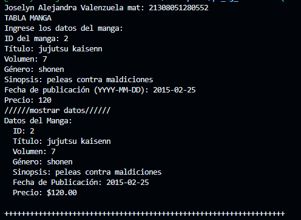
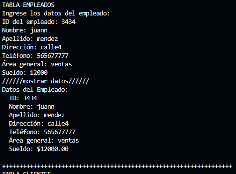
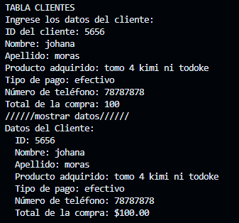

SALIDA DE DATOS

crear una clase manga con 7 atributos(id_manga, titulo, volumen, genero, sinopsis, fecha_publicacion, precio)una funcion captura () y otra mostrardatos() crear la instancia y utilizar los atributos y llamadas a funciones en el lenguaje dart

crear una clase empleados con 7 atributos(id_emp, nombre, apellido, direccion, telefono, area_general, sueldo)una funcion captura () y otra mostrardatos() crear la instancia y utilizar los atributos y llamadas a funciones en el lenguaje dart que pida ingresar los datos

crear una clase cliente con 7 atributos(id_cliente, nombre, apellido, prod_adq, tipo_pago, num_tel, total_compra)una funcion captura () y otra mostrardatos() crear la instancia y utilizar los atributos y llamadas a funciones en el lenguaje dart que pida ingresar los datos

