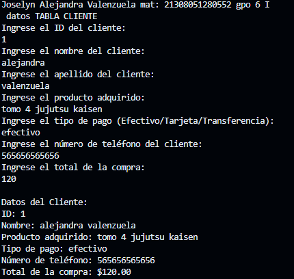
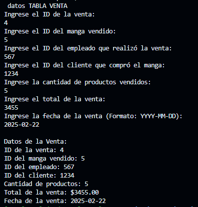

crear la clase Cliente con los atributos (id_cliente , nombre, apellido, prod_adq, tipo_pago, num_tel, total_compra) con una función capturadatos(), con interacción de interfaz de usuario. crear la clase DatosCliente con herencia Cliente y una función mostrarDatos() lenguaje dart

salida de datos

crear la clase ventas con los atributos (id_venta , id_manga, id_empleado, id_cliente, cantidad_prod, total, fecha_venta) con una función capturadatos(), con interacción de interfaz de usuario. crear la clase DatosVenta con herencia Venta y una función mostrarDatos() lenguaje dart

