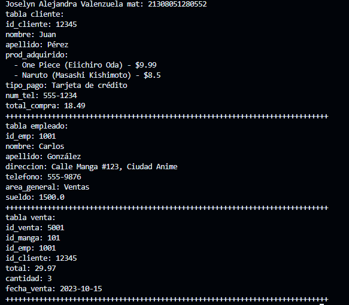

1-crear map <string, dynamic> cliente con los siguientes key, id_cliente, nombre, apellido, prod_adquirido, tipo_pago, num_tel, total_compra.  y mostrar los datos con un foreach. lenguaje dart

2-crear map <string, dynamic> empleados con los siguientes key, id_emp, nombre, apellido, direccion, telefono, area_general, sueldo.  y mostrar los datos con un foreach. lenguaje dart 

3-crear map <string, dynamic> ventas con los siguientes key, id_venta, id_manga, id_emp, id_cliente, total, cantidad, fecha_venta.  y mostrar los datos con un foreach. lenguaje dart

salida de datos

